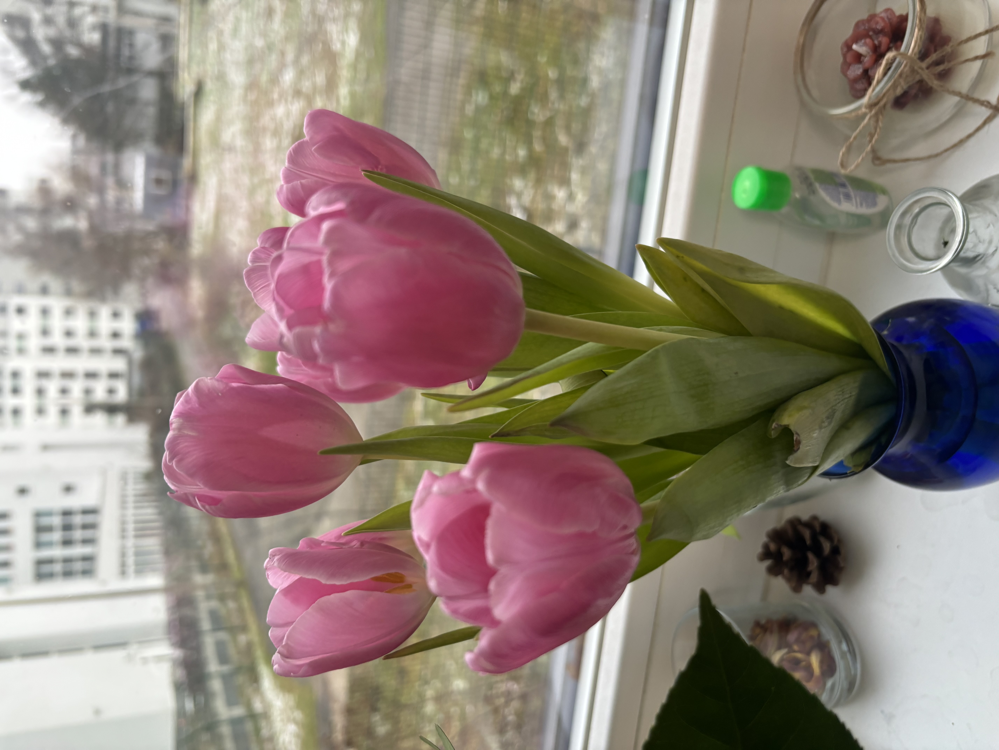
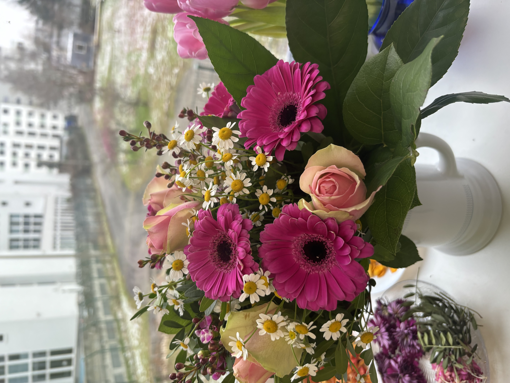
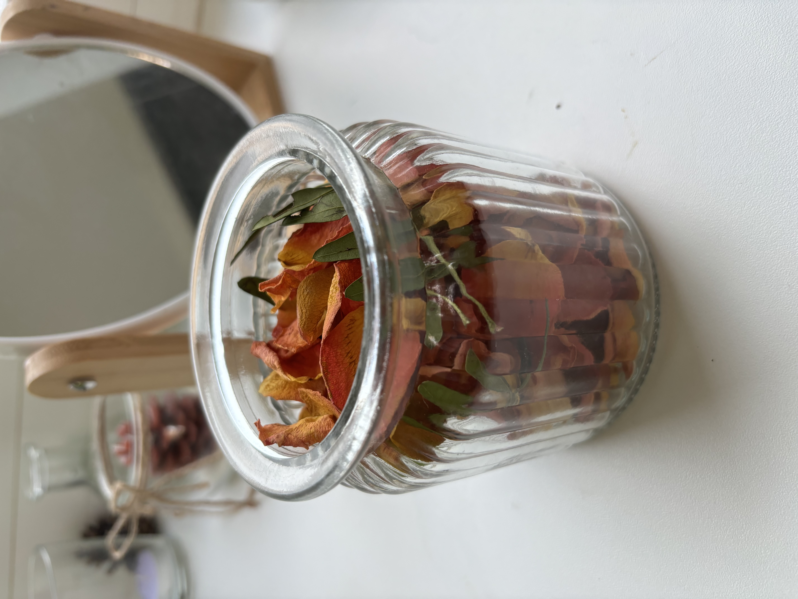

It’s been one week since we stepped into 2024. I would like to briefly summarize what the first week of 2024 was like for me.

I started the year with lots of flowers around me! I love giving myself and receiving from others a colorful and fragrant bouquet. Below are some of the flowers from this week:

I memorized the lyrics of my university’s anthem! It’s written in Urdu. I must have heard (and half-sung) it a hundred times at the university, but I never memorized the lyrics (in the correct order!) until now. This exercise made me think of my friend Ghazala. She was among the first people I befriended at the university and many of my memories of being there are also associated with her. Ghazala and I used to get very emotional and filled with a sense of loyalty and connection towards our university (and toward each other) whenever we sang or listened to the anthem together. I am glad I finally memorized it!

I finished reading “Reflections on the Guillotine” by Albert Camus. I had recently watched an Amazon Prime series that concluded with a debate around the morality of the death penalty, and I wanted to learn more. It was interesting to read Camus’s views, which were, of course, focused primarily on mid-20th century France. I am now further interested in reading about the state of death penalty laws in India and other countries.

I ended the week by coloring Mandala patterns. I went to Dussman with a friend yesterday and got myself some Mandala books and a set of colored pens (Dussman is one of my favorite places to be in Berlin). Coloring Mandalas helps me to calm myself during moments of anxiety and panic. I will share photos when I finish coloring the first pattern. 

Oh, one more “artsy” thing I did during the week was to make potpourri out of the previous flowers I had received (or got for myself). I let the petals dry out on a tray, and once dried, I sprinkled some rose oil on them and transferred them into a pretty jar. It smells wonderful and here’s how it looks:

I was unwell the first two days of the year, leading to a slow start. That made me feel quite frustrated and sad as I was very ambitious about this week, and I wanted to make a "strong start" into the year (duh!). But, I think I still managed to save the week by doing smaller tasks and enjoying myself doing art. In fact, an artful start to the year is a perfect start! 
