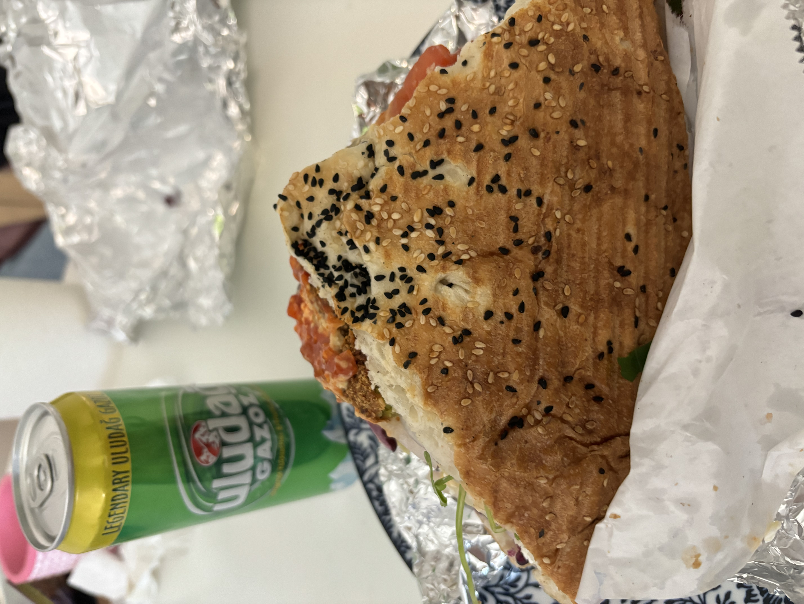
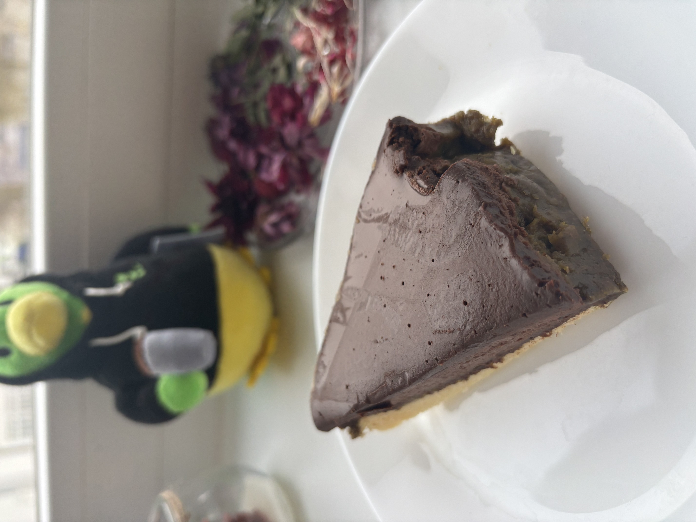
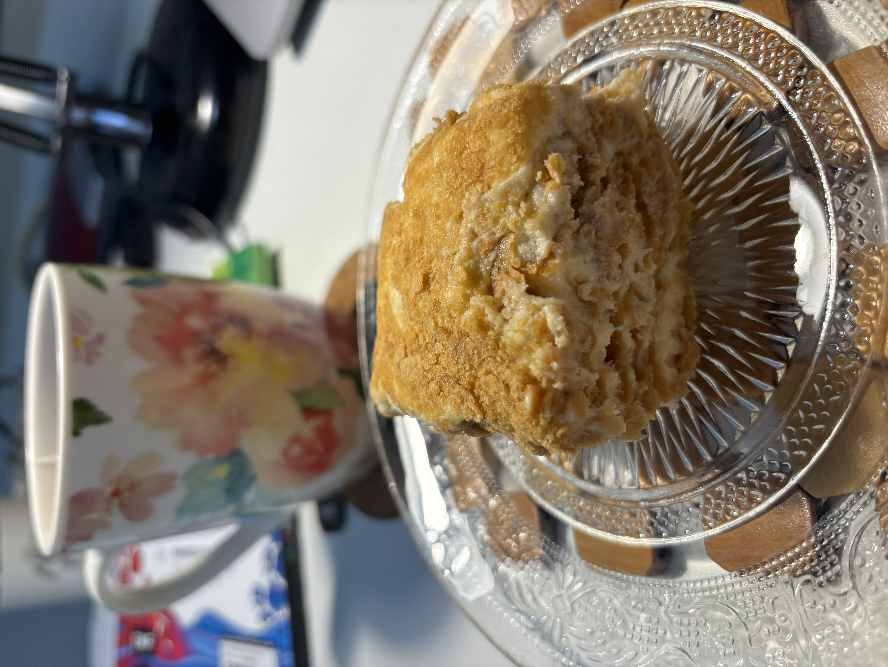
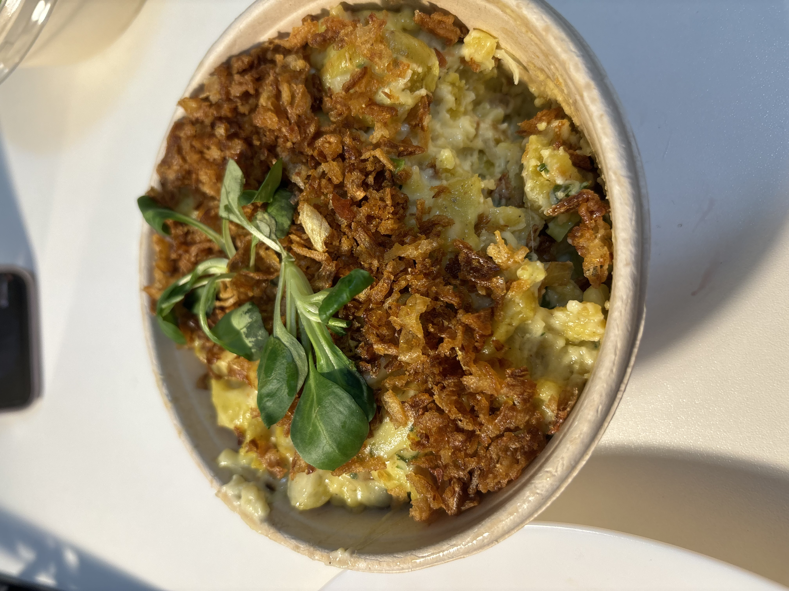
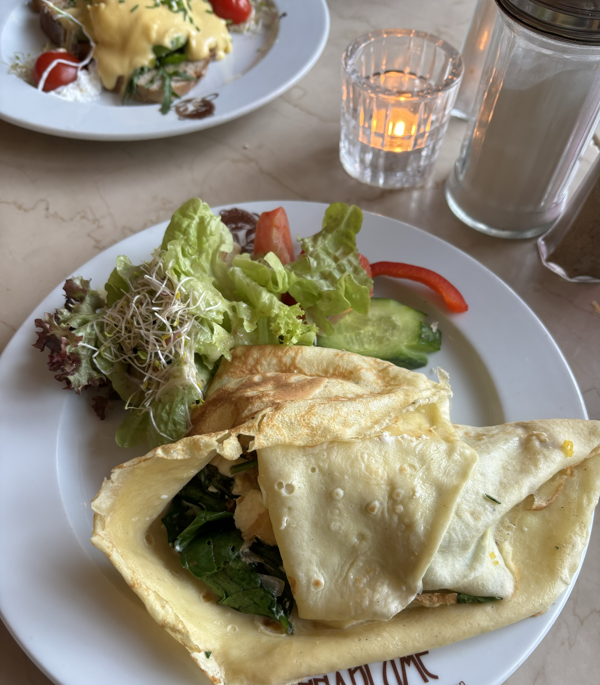
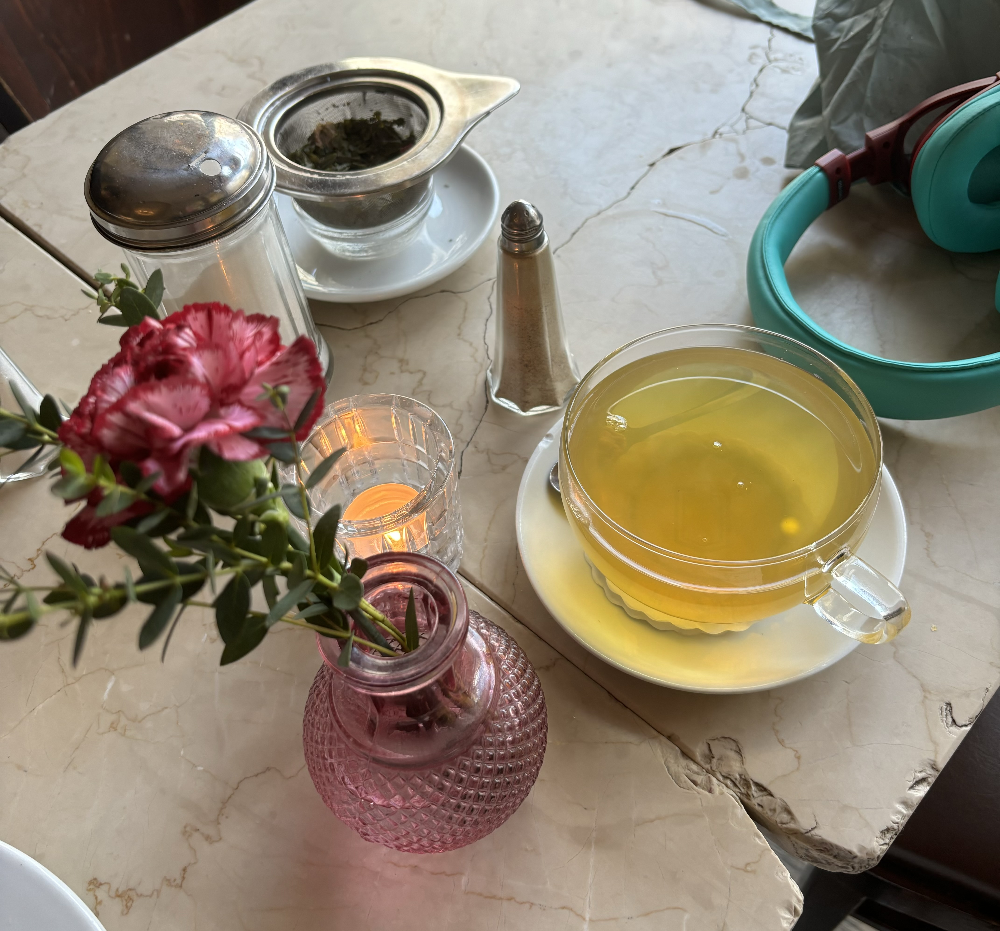
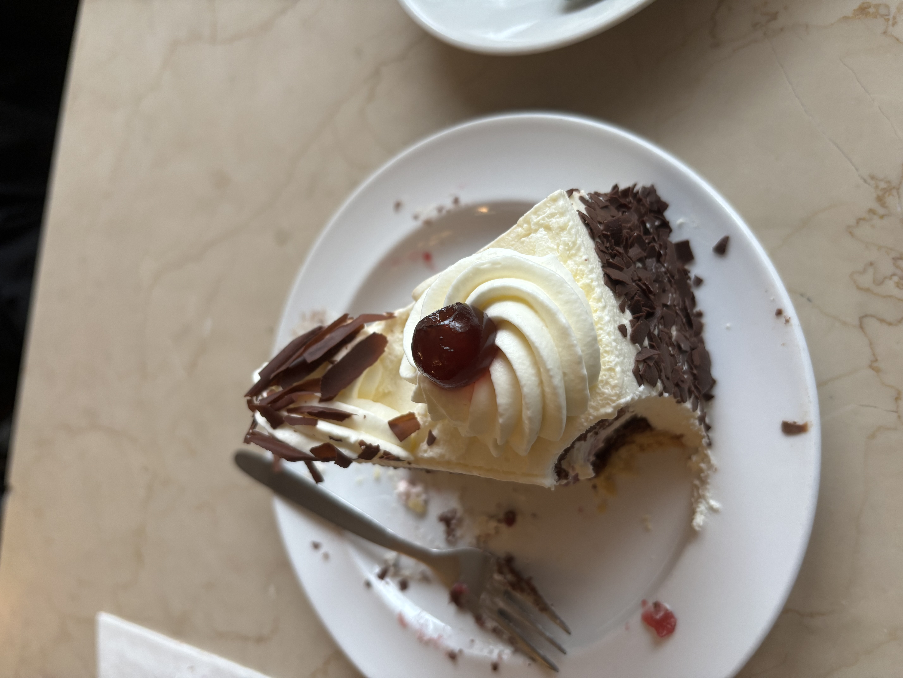

This week was quite hard for me. Nothing terrible happened. But what did happen was the birth of this agitating scare of death. It was a paralyzing fear. It still is, when my focus returns to it. I had never before thought of my death with such clarity and "nearness". 
I have no insights to offer you. No big, deep philosophical ideas emerging from my experience. All I tell you is that I was very very scared.

Given what occupied my mind the most, this week was also a very unproductive week. 
I didn't read, write, or made any form of art. I was not present for my parents, didn't feel up to taking their calls. I did not perform well at work either. Overall, a failure week. 

I ate a lot of Falafel Doner. Almost everyday.  
I always get it from the same doner place near my apartment. Doner is for Berlin what Chole Bhature is for Delhi; it's everywhere! And most Doner shops are open till 3 or 4 am so that the party animals of Berlin don't go home hungry. 
This is what a Falafel Doner looks like:

In the background you see "Uludag". The Turkish sprite. I love to drink it with my Doner.

My stress eating ofcourse also involved sweets. 
Below is Pistachio Chocolate Mousse Cake from a cafe in PBerg. 

This is a Napolean pastry that a friend sent for me. I didn't like it much.

This is Spatzle mit Kase. One of my most favourite German foods. Technically it is pasta (or noodles) with cheese, but it's just better than pasta! I think the fried onions on top have definitely got something to do with that "better". 

A friend came over on Friday to help me navigate my tumultous emotions. It did help. Talking to a human, face-to-face, in real life helps.

And you wouldn't believe how I ended the week which started with thoughts of death, I went on a date! 
What a lovely, sweet Sunday afternoon. This guy was kind, chivalrous, and sweet. And we actually had things to talk about! It was our second date. In the morning I almost thought of cancelling, but he was too sweet and nice on the first date and I didn't want to disappoint him. I am glad I met him today. He took me to Mauer Park and showed me his favourite spots which were the colorful grafitti walls and the atrium where musical performances take place in the summer. It was refreshing to walk in the park despite the cold. I felt positive and light and happy in general. 
We went to a beautiful cafe and had a delicious (and healthy) brunch. 

I had Crepes with Spinach:

And Japanese Sencha tea:

And we shared a piece of cake:

The dark, heavy thoughts did return when I reached home and was alone again. They are going to stay in my mind for sometime, I only need to manage them, put them in a corner and focus instead on the small, brighter things that keep happening despite the darkness.  

One of the graffits I saw today summarizes my week: One Big Struggle. 

