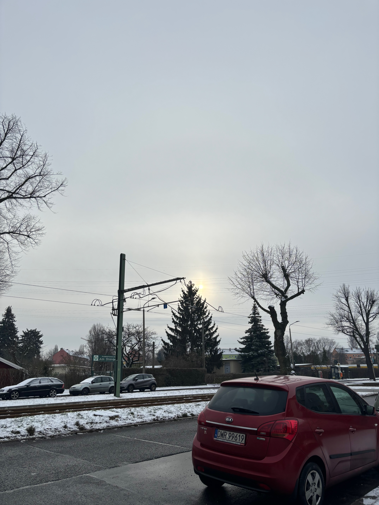
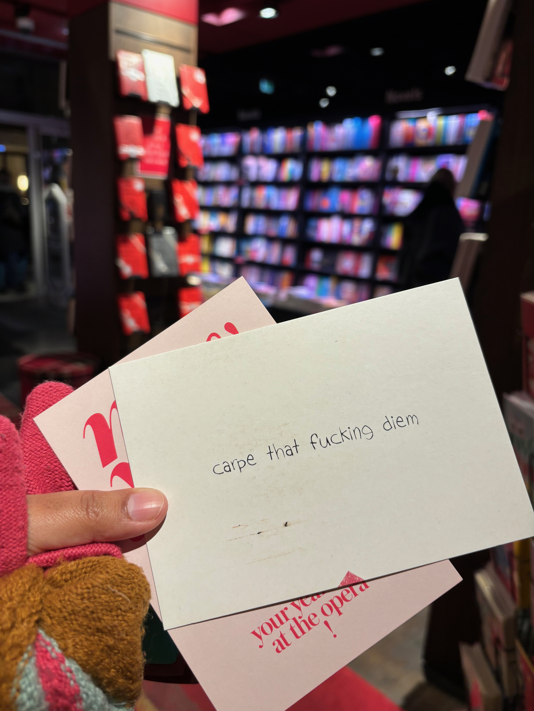
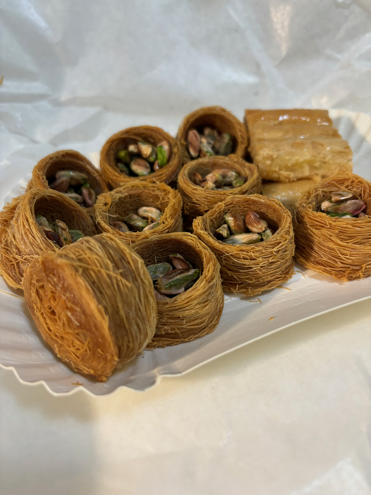
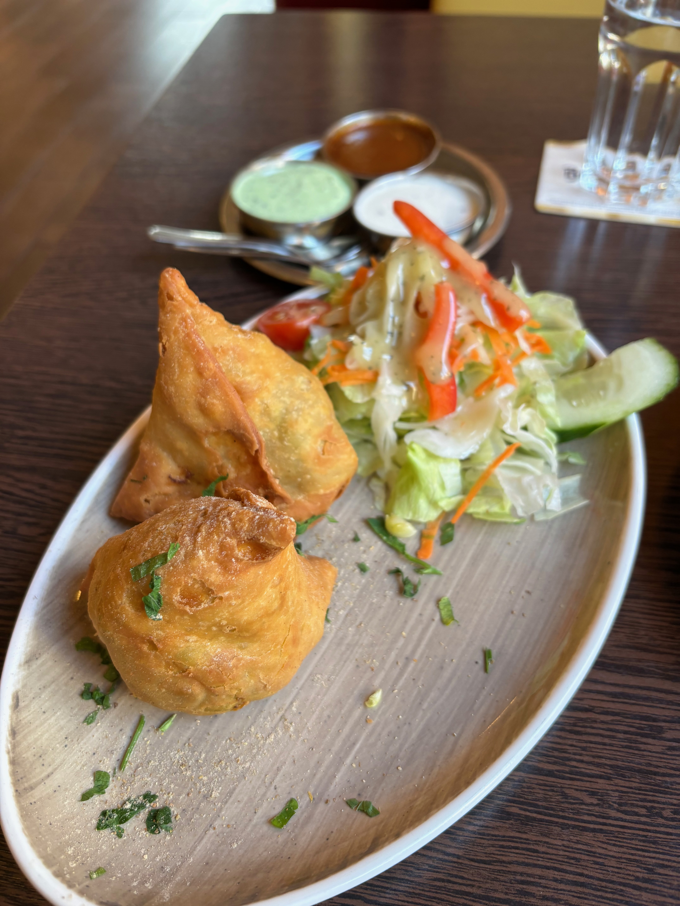
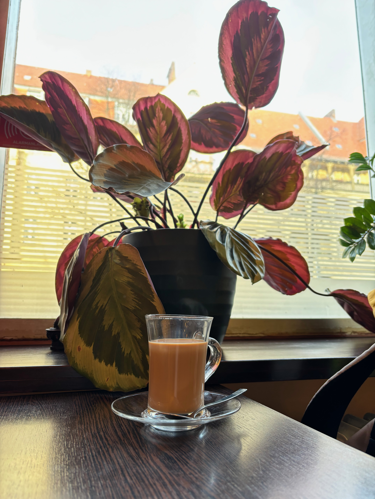
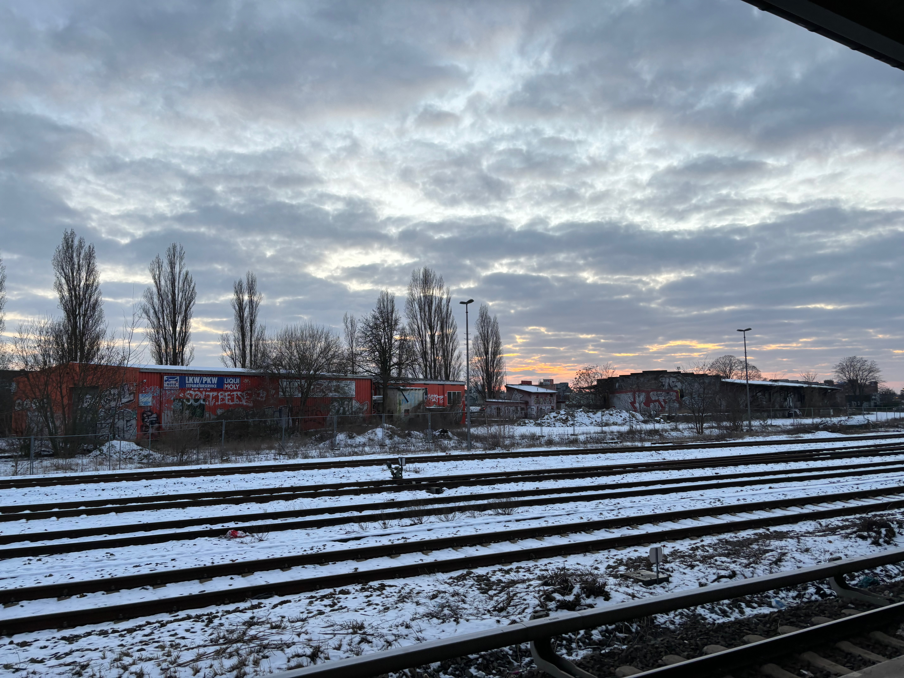
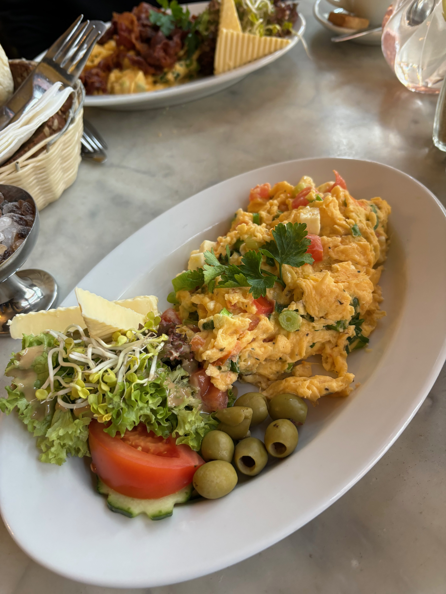
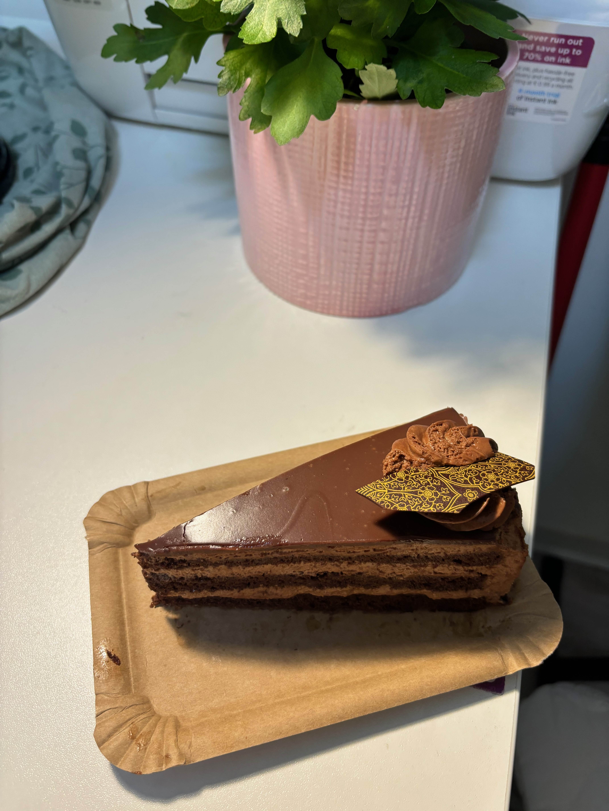

I am writing this blog post two days late. And I seem to have already forgotten what the third week of 2024 was like. 
I looked at the pictures in my phone to recollect. 

Monday was snowy und _zu kalt_!
The sun barely peeped at us for a couple of hours on Tuesday. 

I made a trip to Dussman. It has much more than just books to offer!

Wise words on a postcard: 

I went to the Neukoln area to get my favourite Baklava. Baklava comes in many different shapes with different nuts (pistachio, cashews etc). My favourite is this one with pistachios. 

I call it the "Bird's Nest Baklava". :) 

The Neukoln area is populated by many immigrants from the Arab world. The road side stalls in this area are colorful and very representative of the culture of the people there.

<!-- There was also a Pro Palestine demonstration ongoing that day. 

<insert video of palestine demo> -->

I had to make a trip to Tempelhof that week. 
It was so cold and windy that day, I started to feel dizzy and nauseated during the short walk to my destination after travelling for one hour in the S-Bahn. I concluded that I desperately needed a warm drink. And not any warm drink, I wanted a hot cup of Desi Chai. 
I decided to make a small respite at a "Singaporean + Indian" resturant called "Majha" that I found nearby and had a plate of samosas with a cup of Masala Chai. 

I love Chai and I heavily rely on it especially during these horrid winters of Germany. Getting a cup of Chai in a resturant here usually proves too expensive for the quality and quantity. 
I decided to buy a thermal flask and carry my own Chai wherever I go. 

The sun was setting beautifully on that snow ridden Saturday as I headed back to the train station.

On my way back, there was a cool German rapper in the train! 

<!--  -->

Berlin public transport is always so entertaining.
I remember once I was travelling within PBerg in the tram and there was a man sitting with a real, alive chicken on his lap. And he seemed to be talking to his chicken! What a sight! 

On Sunday I went to a nice cafe for breakfast with someone. 
I had a "Mayoko" scrambeled eggs. 

And I brought home a piece of <i> Schokopraline </i> cake with me. 

Other things that happened:  
I had dinner at a friend's place.
They had prepared a delicious Butter Chicken for us. I came back feeling very inspired and motivated after my friend updated me on all the things they had been doing in the last days.  
I had a doctor's appointment where I forgot my book in the waiting area (Brick Lane). One of these I need to go back and get it.  
I started taking cold showers (started out with a one min cold shower at the end of a regular warm shower).  
I went to an Open Source Meetup in a cafe. It was nice to meet people who are so driven and passionate about creating new products/companies.  
On one particular day I was especially down and decided to get dressed up and wear my new earrings to feel better. And I did feel better!  
I think this could be another tool in my toolkit for gloomy days! :)
